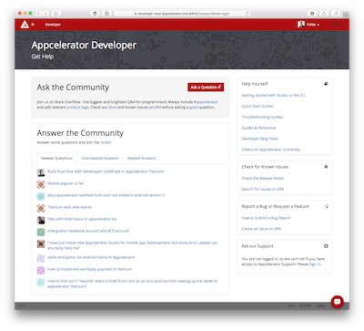

# Appcelerator Developer

This Arrow App will replace [appc-legacy-qa](https://github.com/appcelerator/appc-legacy-qa) to run at [developer.appcelerator.com](https://developer.appcelerator.com).

All [legacy routes](web/routes/legacy) to the original Q&A's questions and tags redirect to relevant queries on Stack Overflow. All those for the original DevLink redirect to the new [appc-devlink-server](https://github.com/appcelerator-developer-relations/appc-devlink-server) at [devlink.appcelerator.com](https://devlink.appcelerator.com).

Over time we can expand this into a proper *Developer Portal*, possibly replacing fragmented properties like [web.appcelerator.com](https://web.appcelerator.com), closely integrated (or even merged) with a browser-compatible version of [appc-studio.appcelerator.com](https://appc-studio.appcelerator.com) but most of all a portal to all relevant information for Appcelerator Developers.



## Run

### Against preproduction

1. Make sure your localhost is mapped to `developer-local.cloud.appctest.com` in `/etc/hosts`:

		127.0.0.1	developer-local.cloud.appctest.com

2. Make sure you're logged into preproduction:

		appc config set defaultEnvironment preproduction && appc login

2. Run the app:

		appc run

### Against production

1. Make sure your localhost is mapped to `developer-local.appcelerator.com` in `/etc/hosts`:

		127.0.0.1	developer-local.appcelerator.com

2. Make sure you're logged into production:

		appc config set defaultEnvironment production && appc login

2. Run the app:

		appc run

## Develop

### Build CSS (LESS) & JS

The [styles.css](web/public/css/styles.css) is generated from [default.less](web/src/less/default.less) which imports Bootstrap. The [Gruntfile](Gruntfile.js) registers tasks to generate the css:

```
grunt css
```

Add any Bootstrap JS plugins and other scripts like [default.js](web/src/js/default.js) to the list in the [Gruntfile](Gruntfile.js) and then run the js-task to concat and uglify them:

```
grunt js
```

Or keep an additional terminal window open and watch for LESS/JS changes:

```
grunt dev
```

## Publish
The [Gruntfile](Gruntfile.js) has a task to build CSS/JS, unpublish previous versions, bump the patch version of the [package.json](package.json) and then publish the new version.

> **NOTE:** Make sure you are logged into the right environment and organization.

```
grunt publish
```
